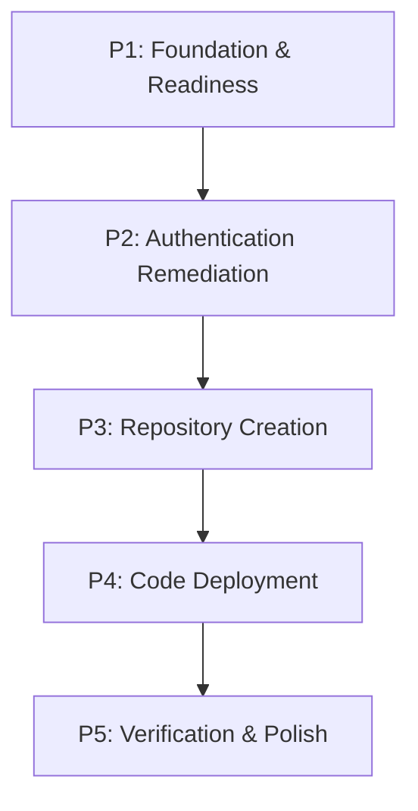

# Implementation Plan: MAKER Framework Extension Deployment
**Date:** February 24, 2026
**Slug:** maker-extension-deployment
**Status:** Draft

## 1. Plan Overview
This plan outlines the 5-phase deployment of the MAKER extension to GitHub. It focuses on resolving GitHub extension authentication, creating a public repository, and ensuring the extension is installable via URL.

- **Total Phases:** 5
- **Agents Involved:** `architect`, `devops_engineer`, `technical_writer`, `code_reviewer`
- **Estimated Effort:** ~15-20 agent turns

## 2. Dependency Graph

## 3. Execution Strategy

| Phase | Agent | Model | Priority | Parallel |
|-------|-------|-------|----------|----------|
| P1: Foundation | `architect` | Pro | Critical | No |
| P2: Authentication | `devops_engineer` | Pro | Critical | No |
| P3: Repo Creation | `devops_engineer` | Pro | High | No |
| P4: Deployment | `devops_engineer` | Pro | High | No |
| P5: Verification | `code_reviewer` | Pro | High | No |

## 4. Phase Details

### Phase 1: Foundation & Readiness
- **Objective:** Ensure the MAKER extension is clean, built, and has the required `package.json` and `gemini-extension.json`.
- **Agent:** `architect`
- **Files to Modify:**
  - `package.json`: Verify versioning and dependencies.
  - `gemini-extension.json`: Ensure command definitions are correct.
- **Validation:** `npm run build` and manual check of manifest files.

### Phase 2: Authentication Remediation
- **Objective:** Resolve the "badly formatted" authorization error by correctly setting the `GITHUB_PERSONAL_ACCESS_TOKEN`.
- **Agent:** `devops_engineer`
- **Implementation Details:** 
  - Locate or request the user's PAT.
  - Inject the PAT into the environment or extension configuration.
  - Test the connection using a read-only command like `github:search-repositories`.
- **Validation:** Successful execution of a `github` extension tool.

### Phase 3: Repository Creation
- **Objective:** Create the public `maker-framework-extension` repository.
- **Agent:** `devops_engineer`
- **Implementation Details:**
  - Use `github:create-repository` tool.
  - Name: `maker-framework-extension`.
  - Visibility: Public.
- **Validation:** Confirm repo exists at `https://github.com/rochdi-mohamedtarik/maker-framework-extension`.

### Phase 4: Code Deployment
- **Objective:** Push the local source code to the new GitHub repository.
- **Agent:** `devops_engineer`
- **Implementation Details:**
  - Initialize local git if necessary.
  - Add remote origin.
  - Commit and push all files (respecting `.gitignore`).
- **Validation:** Verify files are visible on GitHub.

### Phase 5: Verification & Polish
- **Objective:** Final check for installability and documentation quality.
- **Agent:** `code_reviewer`
- **Files to Modify:**
  - `README.md`: Ensure the installation URL is correct.
- **Implementation Details:**
  - Verify repo structure.
  - Ensure `gemini-extension.json` is at root.
- **Validation:** Simulated `gemini extensions install` command.

## 5. File Inventory

| File Path | Phase | Purpose |
|-----------|-------|---------|
| `package.json` | P1 | Project manifest |
| `gemini-extension.json` | P1 | Extension registration |
| `README.md` | P5 | Installation instructions |
| `deployment-state.json`| All | Persistence logic |

## 6. Execution Profile
- **Total phases:** 5
- **Parallelizable phases:** 0 (strictly sequential)
- **Sequential-only phases:** 5
- **Estimated wall time:** ~2-3 hours

## 7. Cost Estimation
| Phase | Agent | Model | Est. Input | Est. Output | Est. Cost |
|-------|-------|-------|-----------|------------|----------|
| P1 | `architect` | Pro | 3K | 1K | $0.07 |
| P2 | `devops_engineer` | Pro | 5K | 2K | $0.13 |
| P3 | `devops_engineer` | Pro | 4K | 1K | $0.08 |
| P4 | `devops_engineer` | Pro | 8K | 3K | $0.20 |
| P5 | `code_reviewer` | Pro | 6K | 2K | $0.14 |
| **Total** | | | **26K** | **9K** | **$0.62** |
