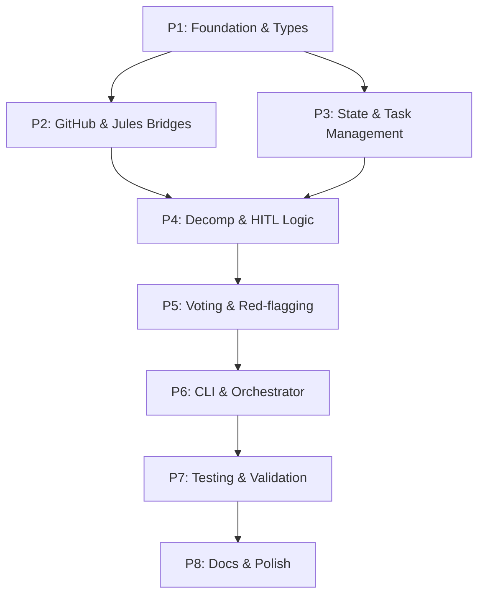

# Implementation Plan: MAKER Framework Gemini CLI Extension
**Date:** February 24, 2026
**Slug:** maker-extension
**Status:** Draft

## 1. Plan Overview
This plan outlines the 8-phase implementation of the MAKER Gemini CLI extension. It focuses on recursive decomposition, first-to-ahead-by-k voting, and integration with Jules and GitHub.

- **Total Phases:** 8
- **Agents Involved:** `coder`, `tester`, `technical_writer`, `code_reviewer`
- **Estimated Effort:** ~40-60 agent turns

## 2. Dependency Graph

## 3. Execution Strategy

| Phase | Agent | Model | Priority | Parallel |
|-------|-------|-------|----------|----------|
| P1: Foundation | `coder` | Pro | Critical | No |
| P2: Bridges | `coder` | Pro | High | Yes (with P3) |
| P3: State | `coder` | Pro | High | Yes (with P2) |
| P4: Decomp | `coder` | Pro | High | No |
| P5: Voting | `coder` | Pro | High | No |
| P6: Orchestrator | `coder` | Pro | High | No |
| P7: Testing | `tester` | Pro | Medium | No |
| P8: Docs | `technical_writer` | Pro | Low | No |

## 4. Phase Details

### Phase 1: Foundation & Types
- **Objective:** Establish the core data structures and project configuration.
- **Agent:** `coder`
- **Files to Create:**
  - `package.json`: Project metadata and dependencies (typescript, ts-node, etc.)
  - `tsconfig.json`: TypeScript configuration.
  - `gemini-extension.json`: Extension manifest defining the `maker` command.
  - `src/types/maker.ts`: Core interfaces (`IMakerTask`, `IRedFlagResult`, `IVoteResult`, `MakerConfig`).
- **Validation:** `npm run build` (ensure types compile).

### Phase 2: GitHub & Jules Bridges
- **Objective:** Implement the communication layer with the `github` and `jules` extensions.
- **Agent:** `coder`
- **Files to Create:**
  - `src/bridges/github.ts`: Wrapper for MCP GitHub tools (create repo, branch, PR).
  - `src/bridges/jules.ts`: Wrapper for calling `jules` tasks.
- **Implementation Details:** Use `run_shell_command` to invoke the `gemini` CLI for tool calls.
- **Validation:** Mock shell commands and verify bridge logic.

### Phase 3: State & Task Management
- **Objective:** Implement persistent state management for the decomposition tree.
- **Agent:** `coder`
- **Files to Create:**
  - `src/utils/state-manager.ts`: Logic to read/write `maker-state.json`.
  - `src/utils/task-tree.ts`: Helper class to manage the recursive task nodes.
- **Validation:** Unit tests for tree insertion, lookup, and persistence.

### Phase 4: Decomposition Agent & HITL Logic
- **Objective:** Implement recursive decomposition and iterative clarification prompts.
- **Agent:** `coder`
- **Files to Create:**
  - `src/agents/decomposition.ts`: Specialized prompt and logic for splitting tasks.
  - `src/utils/hitl.ts`: Logic for user clarification and veto prompts.
- **Implementation Details:** Integrate `ask_user` for the HITL components.
- **Validation:** Test decomposition of a sample "Idea" with a manual clarification trigger.

### Phase 5: Voting Agent & Red-flagging
- **Objective:** Implement the error-correction sampling and filtering logic.
- **Agent:** `coder`
- **Files to Create:**
  - `src/agents/voting.ts`: Logic for $n$ parallel samples and winner determination.
  - `src/utils/red-flagging.ts`: Parser to filter outputs based on rules and LLM checks.
- **Implementation Details:** Implement "first-to-ahead-by-k" threshold check.
- **Validation:** Simulate split votes and red-flags to verify the fallback/veto triggers.

### Phase 6: CLI Command & Orchestrator
- **Objective:** Link all components into the main `gemini maker` command.
- **Agent:** `coder`
- **Files to Create:**
  - `src/index.ts`: Extension entry point.
  - `src/orchestrator.ts`: Main loop managing the MDAP lifecycle.
- **Validation:** Run a full "dry-run" of the orchestrator with mocked Jules/GitHub responses.

### Phase 7: Testing & Validation
- **Objective:** Comprehensive testing of the "Idea to Product" workflow.
- **Agent:** `tester`
- **Files to Create:**
  - `tests/integration.test.ts`: End-to-end flow test.
  - `tests/maker-logic.test.ts`: Tests for voting and red-flagging edge cases.
- **Validation:** Ensure all tests pass and coverage is >80%.

### Phase 8: Documentation & Polish
- **Objective:** Final documentation and user guide.
- **Agent:** `technical_writer`
- **Files to Create:**
  - `README.md`: Usage guide, configuration options, and architectural overview.
  - `GEMINI.md`: Internal instructions for the Gemini CLI about how to use the extension.
- **Validation:** Proofread and verify all links/commands in README.

## 5. File Inventory

| File Path | Phase | Purpose |
|-----------|-------|---------|
| `package.json` | P1 | Dependencies & scripts |
| `gemini-extension.json` | P1 | Extension manifest |
| `src/types/maker.ts` | P1 | Shared type definitions |
| `src/bridges/github.ts` | P2 | GitHub MCP integration |
| `src/bridges/jules.ts` | P2 | Jules extension integration |
| `src/utils/state-manager.ts`| P3 | Persistence logic |
| `src/agents/decomposition.ts`| P4 | Recursive splitting logic |
| `src/utils/hitl.ts` | P4 | User interaction module |
| `src/agents/voting.ts` | P5 | Error correction & sampling |
| `src/utils/red-flagging.ts` | P5 | Output filtering |
| `src/orchestrator.ts` | P6 | Main MDAP loop |
| `src/index.ts` | P6 | CLI entry point |
| `tests/integration.test.ts`| P7 | End-to-end verification |
| `README.md` | P8 | User documentation |

## 6. Execution Profile
- **Total phases:** 8
- **Parallelizable phases:** 2 (P2 & P3)
- **Sequential-only phases:** 6
- **Estimated parallel wall time:** ~4-6 hours
- **Estimated sequential wall time:** ~6-8 hours

## 7. Cost Estimation
| Phase | Agent | Model | Est. Input | Est. Output | Est. Cost |
|-------|-------|-------|-----------|------------|----------|
| P1 | `coder` | Pro | 5K | 2K | $0.13 |
| P2 | `coder` | Pro | 8K | 3K | $0.20 |
| P3 | `coder` | Pro | 8K | 3K | $0.20 |
| P4 | `coder` | Pro | 12K | 4K | $0.28 |
| P5 | `coder` | Pro | 12K | 4K | $0.28 |
| P6 | `coder` | Pro | 15K | 5K | $0.35 |
| P7 | `tester` | Pro | 20K | 8K | $0.52 |
| P8 | `technical_writer`| Pro | 10K | 5K | $0.30 |
| **Total** | | | **90K** | **34K** | **$2.26** |
