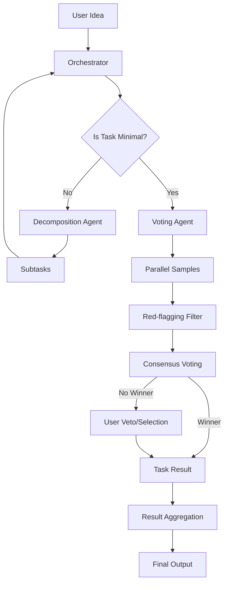

# MAKER Gemini CLI Extension

The **MAKER** (Massively Decomposed Agentic Process) framework is a recursive decomposition strategy designed to solve complex tasks with high reliability. It leverages a multi-agent architecture to break down high-level ideas into manageable subtasks, ensuring quality through voting and red-flagging mechanisms.

## Core Concepts

### 1. Massively Decomposed Agentic Process (MDAP)
MAKER uses a recursive decomposition pattern. A complex task is broken down into smaller subtasks until "minimal" tasks are reached. These minimal tasks are simple enough to be executed directly by specialized agents.

### 2. Voting Agent
For every minimal task, MAKER runs multiple parallel attempts. It employs a **"first-to-ahead-by-k"** voting logic to select the most consistent and reliable solution. This ensures that the final output is not just a single agent's guess but a consensus-driven result.

### 3. Red-flagging
All agent outputs are passed through a red-flagging layer. This layer identifies potential issues such as:
- Refusals or uncertainty ("I don't know", "As an AI...")
- Formatting errors (missing code blocks)
- Explicit error messages or exceptions
- Excessive repetition
- Insufficient detail

### 4. Human-In-The-Loop (HITL)
MAKER integrates iterative clarification and veto mechanisms. If a task is ambiguous or if the voting process fails to reach a consensus, the framework prompts the user for more details or a final decision.

## Architecture



## Installation

To install the MAKER extension, clone the repository and install dependencies:

```bash
git clone https://github.com/your-repo/maker-framework.git
cd maker-framework
npm install
npm run build
```

## Usage

### Starting a New Process
Run the MAKER framework on a new idea:

```bash
gemini maker "Build a React-based weather dashboard with unit tests"
```

Or using the direct command:

```bash
maker run "Build a React-based weather dashboard with unit tests"
```

### Resuming a Process
If a process was interrupted, you can resume it from the last saved state:

```bash
maker resume ./maker-state.json
```

## State Management and Resumability

MAKER automatically persists the state of the process in a `maker-state.json` file in the current directory. This file contains the entire task tree, including:
- Task descriptions and statuses.
- Candidate solutions and vote counts.
- Configuration used for the process.
- Metadata such as start time and repository information.

If a process is interrupted (e.g., due to a network error or manual stop), you can resume it using:

```bash
maker resume ./maker-state.json
```

The orchestrator will identify the last pending or in-progress task and continue from there, avoiding redundant work.

## Configuration

You can configure the MAKER framework behavior through the `MakerConfig` interface:

| Option | Type | Default | Description |
| :--- | :--- | :--- | :--- |
| `maxRecursionDepth` | `number` | `3` | Maximum depth for recursive task decomposition. |
| `votingThreshold` | `number` | `2` | The 'k' value for "first-to-ahead-by-k" voting. |
| `redFlagSeverityThreshold` | `string` | `'high'` | Minimum severity to discard a candidate solution. |
| `modelName` | `string` | `'gemini-1.5-pro'` | The Gemini model to use for agent tasks. |

## Integrations

### GitHub
MAKER automatically creates a GitHub repository for each new project to maintain context and version control. It uses the `createRepo` bridge to initialize the workspace.

### Jules
Minimal tasks are executed using **Jules**, a specialized agent bridge that handles environment setup and task execution. MAKER launches multiple Jules sessions in parallel to gather candidate solutions for voting.

## Development

To contribute to the MAKER framework, you can use the following scripts:

- `npm run build`: Compile the TypeScript source code to JavaScript.
- `npm run lint`: Run ESLint to check for code style issues.
- `npm run test`: Run Jest tests to verify the framework's logic.

### Project Structure
- `src/index.ts`: Entry point for the CLI.
- `src/orchestrator.ts`: Core logic for task decomposition and voting.
- `src/agents/`: Specialized agents for decomposition and voting.
- `src/bridges/`: Integrations with external tools (GitHub, Jules).
- `src/utils/`: Utility functions for state management, task trees, and red-flagging.

## Troubleshooting

### GitHub Repository Creation Fails
Ensure you have the `gh` CLI installed and authenticated:
```bash
gh auth status
```
If not authenticated, run:
```bash
gh auth login
```

### Jules Task Execution Fails
Ensure the `jules` extension is installed and available in your environment. MAKER relies on the `jules` CLI to execute minimal tasks.

### No Consensus Reached
If the voting process fails to reach a consensus, MAKER will trigger a **User Veto** round. You will be prompted to select the best candidate or veto all of them. This is common for highly complex or ambiguous tasks.

---
<!-- Source: src/index.ts, src/orchestrator.ts, src/agents/decomposition.ts, src/agents/voting.ts -->
